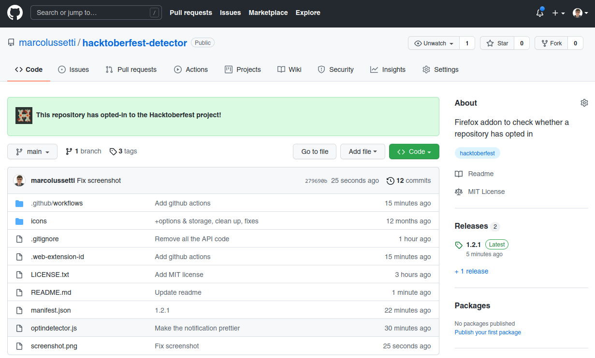

# hacktoberfest-detector

A very, very simple and very, very dumb Firefox & Chrome Add-On to check whether a repository in GitHub is opted-in to the hacktoberfest tag.

## Installation

### Firefox

Addon is pending approval from Mozilla at the moment.

You can install it for now from https://github.com/marcolussetti/hacktoberfest-detector/releases/download/1.2.1/hacktoberfest_detector-1.2.1-an+fx.xpi

### Chrome / Chromium

Until it gets onto the Chrome Web Store (soon?), you will need to:

- Download this repository somewhere, as a folder
- Browse to chrome://extensions/
- Enable the developer mode in the top right by switching the toggle, if necessary
- Click "Load Unpacked" from the top left side
- Browse to the folder and click OK

## Usage

A green alert will appear on all main project pages where the repository has opted in to hacktoberfest.

## License

MIT
